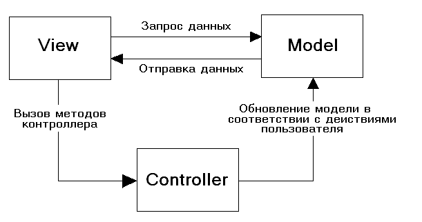
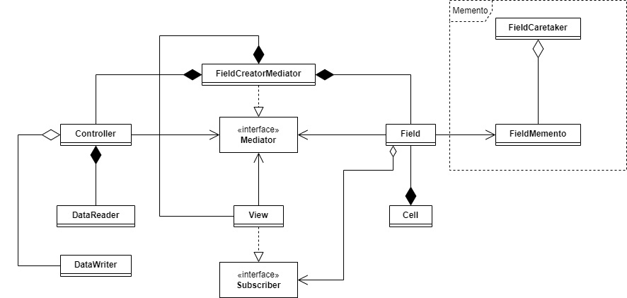

# A* Алгоритм и Визуализация для Java

## Введение
Данный репозиторий содержит реализацию алгоритма A* для решения взвешенных ориентированных графов. Алгоритм предназначен для работы с сетчатым представлением графа и учитывает положительные веса ребер. Проект предоставляет возможность ввода данных через файл или графический интерфейс, а также визуализацию выполнения алгоритма.

## Возможности
- Ввод взвешенных ориентированных графов
- Визуализация графа с визуализацией выполнения алгоритма
- Вывод статуса программы
- Пользовательский интерфейс с различными функциями

## Визуальный интерфейс
Интерфейс программы состоит из нескольких областей:
1. Область отображения графа: Сетчатое поле, где каждая ячейка представляет вершину. Цвет ячейки соответствует стоимости пути к данной вершине (весу). Если вершина была обработана алгоритмом, то в ячейке отображаются три числа: g(v) (левый нижний угол) - вес, h(v) (правый нижний угол) - значение эвристической функции, и f(v) = g(v) + h(v) (правый верхний угол) - оценка стоимости пути. После выполнения алгоритма, найденный путь будет выделен фиолетовым цветом.
2. Область вывода алгоритма: В этой области отображается итоговая стоимость пути после выполнения алгоритма A*.
3. Рабочая область: Набор кнопок для управления программой и взаимодействия:
   - Кнопка "Изменить вершину": Позволяет изменить вес от стартовой вершины до определенной вершины и выводит список возможных весов.
   - Кнопка "Задать размер сетки": Позволяет пользователю задать размер сетки, представляющей граф, путем открытия диалогового окна.
   - Кнопка "Сброс": Очищает все вершины.

## Архитектура
Реализация следует архитектурному шаблону Model-View-Controller (MVC), который разделяет программу на три компонента: Контроллер, Модель и Графика. Ниже приведена диаграмма общей структуры.

Диаграмма классов всех трех компонентов представлена ниже:

## Лицензия
Этот проект распространяется под лицензией MIT. См. файл [LICENSE](LICENSE) для получения дополнительной информации.
